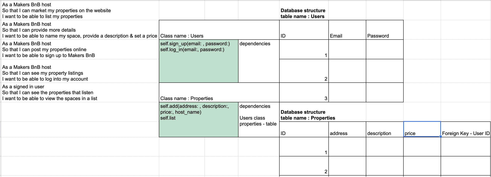

# dogbnb

## User Stories
### MVP(Minimum Viable Product)
```
As a Makers BnB host
So that I can market my properties on the website
I want to be able to add my properties 

As a Makers BnB host
So that I can provide more details
I want to be able to name my property, provide a description & set a price

As a Makers BnB host
So that I can post my properties online
I want to be able to sign up to Makers BnB

As a Makers BnB host
So that I can see my property listings
I want to be able to log into my account

As a signed in user
So that I can see the properties that are listed
I want to be able to view the properties on a list
```


## Set Up
### How to set up database
Connect to `psql` and create the `dogbnb` and `dogbnb_test` databases:
```
CREATE DATABASE dogbnb;
CREATE DATABASE dogbnb_test;
```
Connect to the database using:

```
\c dogbnb;
```
OR
```
\c dogbnb_test;
```
Then set up the appropriate tables in each database by running the SQL scripts in the `db/migrations` folder in the given order.

### How to set up Gems
In your terminal, run:
```
bundle install
```

### How to run app
Start the server in the command line using:
```
rackup
```
Copy the port number at the end of output (E.G `9292`).
Access the website into your URL web browser: `http://localhost:9292/`.

### How to run tests
In your terminal, run:
```
rspec
```

## Domain Model

